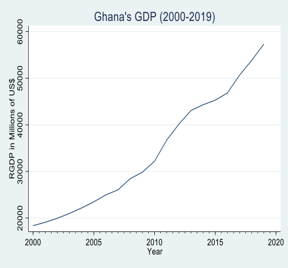
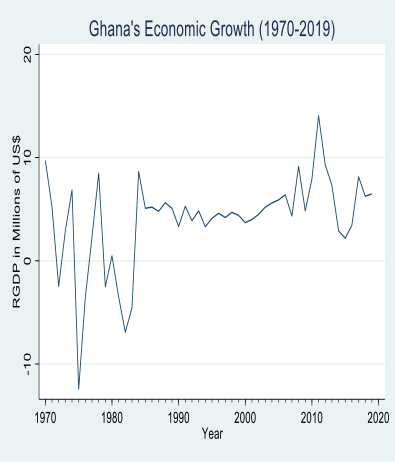
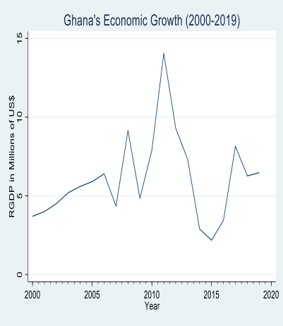
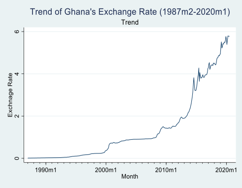
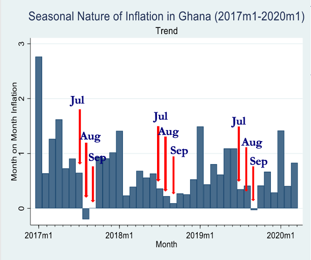
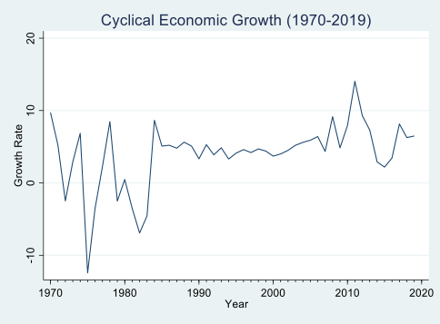
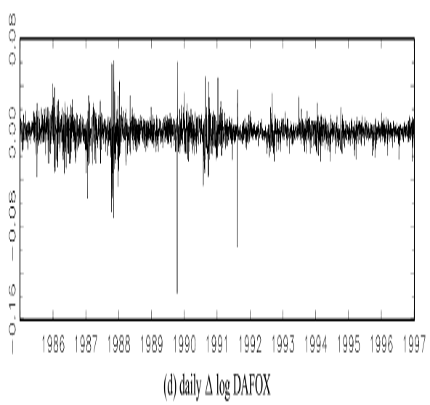

```{r setup, include= FALSE}
library(knitr)
library(magrittr)
library(xaringanExtra)

# set default options
opts_chunk$set(echo = TRUE,
               collapse = FALSE,
               fig.width = 4.252,
               dpi = 300)
xaringanExtra::use_panelset()
knitr::knit_engines$set("markdown")
```
class: title-slide, middle
background-image: url(fig/tpage1.png)
background-position:center
background-size: contain

# **`r rmarkdown::metadata$title`**
### `r rmarkdown::metadata$subtitle`
### `r rmarkdown::metadata$subtitle1`

.directorate[
`r rmarkdown::metadata$author` <br>
`r rmarkdown::metadata$department` <br>
`r rmarkdown::metadata$institute`
]


---
name: about-me
layout: false
class: about-me-slide, inverse, middle, center

# About Me


## William Godfred Cantah (Ph.D)
### Senior Lecturer and Coordinator of CDAMAA

---
layout: true
background-image: url(fig/stpage1.png)
background-size: contain
background-position: center
---
class: inverse center middle

# <p style="font-size:60px; font-weight:bold">Basic Introduction


---
layout: true
background-image: url(fig/page1.png)
background-size: contain
background-position: center
---
<div style="font-size: 33px;">
# Introduction

--
- Planning is necessary for individuals, businesses, governments and institutions. 
--

- Planning requires an understanding of the past and the present. 
--

- This implies you need datasets collected over a while. This is what gives rise to time series analysis. 

--
- A Time Series is a set of observations taken at specified times, usually at equal intervals. 

--
- It can also be seen as a sequence of numerical data in which each item is associated with a particular instant in time. 
- A time series is generally one cross-sectional unit with data points in multiple periods. 
---
<div style="font-size: 30px;">

# Introduction 

--
- Examples: monthly inflation rate, daily closing prices of stock indices, weekly money supply measures, and annual economic growth rate. Etc.

--
- Time series variable could either be a stock series or a flow series 

--
- Stock series are measures of activities at a point in time and can be thought of as stocktakes (e.g., Labour force surveys take stock of whether a person was employed in the reference week)

--
- Flow series are series which are measure of activity to date (e.g., Balance of Payment)

--
- An analysis of a single sequence of data is called <u>*univariate time-series*</u> analysis.

--
- An analysis of several sets of data for the same sequence of time periods is called <u>*multivariate time-series*</u> analysis.

---
# Example of Time Series Graph
.panelset[
.panel[.panel-name[GDP]
.pull-left[
.center[

]
]
.pull-right[
.center[

]
]

]

.panel[.panel-name[GDP Growth]
.pull-left[
.center[

]
]
.pull-right[
.center[

]
]

]
]
---
# Components of Time Series
<div style="font-size: 23px;">
.panelset[.panel[.panel-name[Trend]
.pull-left[
- The tendency for data to increase or decrease over a period of time. 
- A trend is generally a long-term phenomenon. 
- Trend results from long term effects of socio-economic and political factors. 
- It may show the growth or decline in a time series over a long period. 
- This is the type of tendency which continues to persist for a very long period

]

.pull-right[
.center[

]
]
]

.panel[.panel-name[Seasonal Variations]
.pull-left[
- These are the rhythmic forces which operate in a regular and periodic manner over a span of less than a year. 
- They have the same or almost the same pattern during a period of 12 months. 
- This variation will be present in a time series if the data are recorded hourly, daily, - weekly, quarterly, or monthly.
- These variations come into play either because of the natural forces or man-made conventions. 
- The various seasons or climatic conditions play an important role in seasonal variations.

]

.pull-right[
.center[

]
]
]

.panel[.panel-name[Cyclical Variations]
.pull-left[
- The variations in a time series which operate themselves over a span of more than one year are the cyclic variations.
- This oscillatory movement has a period of oscillation of more than a year.

- One complete period is a cycle. 
- This cyclic movement is sometimes called the ‘Business Cycle’.

]

.pull-right[
.center[

]
]
]

.panel[.panel-name[Random or Irregular Movements]
.pull-left[
- There is another factor which causes the variation in the variable under study. 
- They are not regular variations and are purely random or irregular. 
- These fluctuations are unforeseen, uncontrollable, unpredictable, and are erratic. 
- These forces are earthquakes, wars, flood, famines, and any other disasters.


]

.pull-right[
.center[

]
]
]
]

---
# Components of Time Series
----
.pull-left[
----
```{r}
library(readxl) # importing package that would allow us to import excel files to R
library(TSSET) #Converting Dataframe to time series frame
library(tseries) # Undertaking time series analysis 
tsdata<-read_excel(path ="data/timedata.xlsx")
maindata<-tsset(tsdata, start = c(2012,1), frequency = "monthly")
```

]

.pull-right[
----
```{r}
head(maindata)
```
]

---
# Components of Time Series
.pull-left[
----
```{r,warning=FALSE, fig.width=10, fig.height=5, out.width='100%'}
decompose(maindata$FoodInflation, type = "additive")
```
]

.pull-right[
----
```{r,warning=FALSE, fig.width=10, fig.height=5, out.width='100%'}
plot(decompose(maindata$FoodInflation, type = "additive"))
```
]

---
<div style="font-size: 27px;">

# Time Series Notations

--
- A time series on some variable $x$ would be denoted as $x_t$, where the subscript 𝒕 represents time, with $x_t$ being the first observation available on $x$ and $t=T$ being the last. 

--
- The complete set of time series $t=1,2,3,...,T$ will often be referred to as the observation period. 

--
- The observations are typically measured at equally spaced intervals.

--
- Time series can be used to calculate future forecasts &, hence, unknown values of $x_t$ at say, times $T+1, T+2,...,T+h$, where $h$ is the forecast horizon 

--
- Lag operator is used to capture the previous values of TS variable. The lag of a variable in Time Series is usually denoted as $x_{t-1} \ or\  x_{t-2}\  or \ x_{t-k}$. 

--
- We also have the difference operator $\Delta$ in Time Series which captures the difference between the current value of the Series and the Previous value of the same series. i.e., $\Delta x_t=x_t-x_{t=1}$
---
# The Lag and Differencing Operators
----
<div style="font-size: 30px;">
--

- The lag operator $L$ is defined for a time series ${Y}$ by 

$$LY_t=Y_{t-1}$$

--
- The operator can be defined for linear combinations by:
$$L(\alpha Y_t+\beta X_t)=\alpha Y_{t-1}+\beta X_{t-1}$$

--

- In addition to been linear, the lag operator preserves inner products

$$\mathbf{( LY_s, LY_t )} = \mathbf{\text{cov}(Y_{s-1}, Y_{t-1})} = \mathbf{\text{cov}(Y_s, Y_t)} = \mathbf{( Y_s, Y_t )}$$

--
- An operator of this type is called a unitary operator


---
# The Lag and Differencing Operators
----
<div style="font-size: 26px;">

--
- There is natural calculus of operators. For example, we can define powers of 𝐿  naturally by:
--
$$L^2Y_t=LLY_t=LY_{t-1}=Y_{t-2}$$

--
$$L^3 Y_t=LL^2Y_t=Y_{t-3}$$
--
- This can also be represented in a linear combination as:
$$(\alpha L^k+\beta L)Y_t=\alpha Y_{t-k}+\beta Y_{t-1}$$

--
- Other operators can be defined in terms in terms of $L$

--
- The differencing operator defined by

--
$$\Delta Y_t=(1-L)Y_t=Y_t-Y_{t-1}$$
---
# The Lag and Differencing Operators
-----
<div style="font-size: 33px;">

--
- Differencing is of fundamental importance when dealing with models of non-stationary TS.

--
- Again, we can define powers of this operator 

--
$$\Delta^2 Y_t=\Delta(\Delta Y_t)$$

--
$$\ \ \ \ \ \ \ \ \ \ \ \ \ \ \ =\Delta (Y_t -Y_{t-1})$$

--
$$\ \ \ \ \ \ \ \ \ \ \ \ \ \ \ \ \ \ \ \ \ =(Y_t-Y_{t-1})-(Y_{t-1}-Y_{t-2})$$

--
$$\ \ \ \ \ \ =Y_t-2Y_{t-1}+Y_{t-2}$$


---
# Stochastic Process
---------
<div style="font-size: 30px;">

--
- This is any process that describes the evolution in time of a random phenomenon.

--
- Consider a time series variable like GDP growth, a heavily tracked variable.

--
- The value that GDP could take in a particular time period could be random (i.e., stochastic)

--
- Consider the probability density function and cumulative distribution function 

--
- The potential values that GDP could take are what is refer r ed to as a stochastic process. 

--
- Now, of course, each and every year, the actual value of GDP is reported and that value of GDP is realised.

--
- The stochastic process are all the possibilities that GDP could take for a given number of years. 


---
<div style="font-size: 33px;">

# Stationarity
----

--
- Two processes in time series are essential to econometric analysis.

--

- Stationary Processes and Non-stationary Processes. 

--

- The stationarity of a time series processes, as we will get to see later on, has significant implications on how a series behaves and the various properties the series would have. 

--

- The basic idea of Stationarity is that the probability laws governing the process do not change with time 

--

- The process is in statistical equilibrium 

---
<div style="font-size: 30px;">

# Strong Stationarity 
----

--
- For any observation, $t_1, t_2, ..., t_T \in Z$ any specific time say $k \in Z$ and $T=1,2,3,...$

--
- That is the joint distribution function $F$ of the set of random variables from one period will equal that of any other period $k$ period ahead. 

--
- Mathematically, we denote this as: 

--
<div style="font-size: 24px;">
$$FY_{t1},Y_{t2}, Y_{t3},...,Y_{tT}(Y_1,...,Y_T)=FY_{t1+k},Y_{t2+k}, Y_{t3+k},...,Y_{tT+k}(Y_1,...,Y_T)$$

--
<div style="font-size: 30px;">

- To the point, we can consider a series as strictly stationary if the distribution of the values remains the same as time progresses. 

--
<div style="font-size: 30px;">

- As such, the implies that the probability that $Y$ would fall within a particular interval is the same now as at any time in the future or in the past


---
<div style="font-size: 33px;">

# Strong Stationarity 
----

--
- Relating it to our example earlier on GDP 

--
- Recall that at each time period, there could be a multitude of possible values that GDP can take.

--
- These multitude of values are defined in the PDF of GDP at a period in time.

--
- A process is said to be strictly or strongly stationary if the PDF is the same from one time period to another.

--
- This is rather restrictive as this assumes that the PDF of GDP does not change over time and that the possible values it can take are always the same set at each time period.


---
<div style="font-size: 30px;">

# Weak Stationarity 
----

--
- A process is said to be n-order weakly stationary if all its joint moments up to order n exist and are time invariant.

--
- That is, a series is said to be weakly stationary/covariance stationary if it has a:
<div style="font-size: 24px;">
  1. Constant Mean  $- \ \ \ \ \ E(Y_t)=\mu$
  2. Constant Variance  $- \  E(Y_t-\mu)(Y_t-\mu)=\sigma^2<\infty$
  3. Constant autocovariance $- \   E(Y_{t1}-\mu)(Y_{t2}-\mu)=\gamma_{t2-t1} \ \forall \ t_1, t_2$

<div style="font-size: 30px;">
  
--
- An autocovariance is how some $Y$ relates to its previous values.

--

- As the name implies, this is far less restrictive than the strong stationarity as the PDF will be allowed to vary per period for as long as the properties mentioned above still hold.


---
<div style="font-size: 27px;">

# Weak Stationarity 
----

--
- For the case of a weakly stationary series, the way that $Y$ relates to its previous values should only depend on the difference between $t_1$ and $t_2$

--
- This means that the covariance between a present and past value is the same as the covariance between any present and past value. 

--
- This idea or moment condition is summarised as the autocovariance function. 

--
<div style="font-size: 20px;">

$$E[Y_t-E(Y_t)][Y_{t-s}-E(Y_{t-s})]=Y_s, \ s=0,1,2,3,..$$

--
<div style="font-size: 30px;">

- When $s=0$, this suggest that the autocovariance at lag zero is obtained. This is the autocovariance of $Y_t$ with $Y_t$ or simply just the variance of $Y$

--
<div style="font-size: 20px;">

$$E[Y_t-E(Y_t)][Y_{t-s}-E(Y_{t-s})]=E(Y_t-\mu)(Y_t-\mu)=\sigma^2=\gamma_0$$

---
<div style="font-size: 30px;">

# Weak Stationarity 
----

--
- The various covariances $\gamma_s$ are known as autocovariance in a sense that they are the covariances of $Y$ with it's own previous values.

--
- Central to the analysis of time series data is the concept of autocorrelation. 

--
- We measure autocorrelation using the autocovariances normalized by dividing by the variance.

--
- Hence, an autocorrelation coefficient $\rho_s$is given mathematically in the form below.

--
$$\rho_s = \frac{ \text{cov}(y_t, y_{t+s}) }{ \sqrt{\text{var}(y_t)} \cdot \sqrt{\text{var}(y_{t+s})} } = \frac{\gamma_s}{\gamma_0} = \frac{\gamma_s}{\sigma^2}, \ s=0,1,2,3,...$$

---
# **Correlogram**
<div style="font-size: 30px;">
--

- The sample correlogram is the plot of the ACF against 𝑠.

--
- As the ACF lies between −𝟏 and +𝟏, the correlogram also lies between these values.

--
- It can be used to determine stationarity, if the ACF falls immediately from 𝟏 to 𝟎, then equals about 0 thereafter, the series is stationary.

--
- If the ACF declines gradually from 𝟏 to 0 over a prolonged period of time, then it is not stationary

--
- Statistical Significance of the ACF
<div style="font-size: 24px;">

  - The Q statistic can be used to determine if the sample ACFs are jointly equal to zero.
  - If jointly equal to zero we can conclude that the series is stationary.
  - It follows the chi-squared distribution, where the null hypothesis is that the sample ACFs jointly equal zero

---
#  **Significance of an Autocorrelation Coefficient**
<div style="font-size: 27px;">
--
- We can test for the statistical significance of the autocorrelation coefficients by constructing a confidence interval for the estimated autocorrelation coefficients to determine if the autocorrelation coefficient is statistically different from zero.

--
- For a 95% confidence bound, we can compute for the upper and lower bounds using the form below.

--
$$(-1.96\times \frac{1}{\sqrt T}, \ \ +1.96\times \frac{1}{\sqrt T})$$

--
- If the autocorrelation coefficient falls outside of this region for a given s , then the null hypothesis that $\hat{\rho}_s=0$ is rejected.

--
- If it does not fall outside of this confidence region, then we fail to reject the null suggesting that the autocorrelation coefficient is not statistically different from zero.


